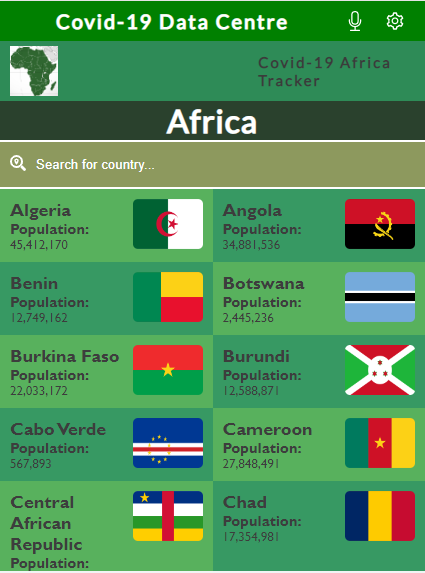
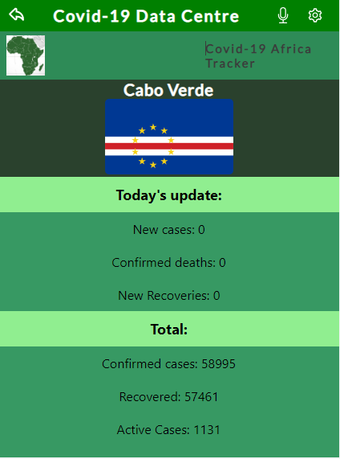
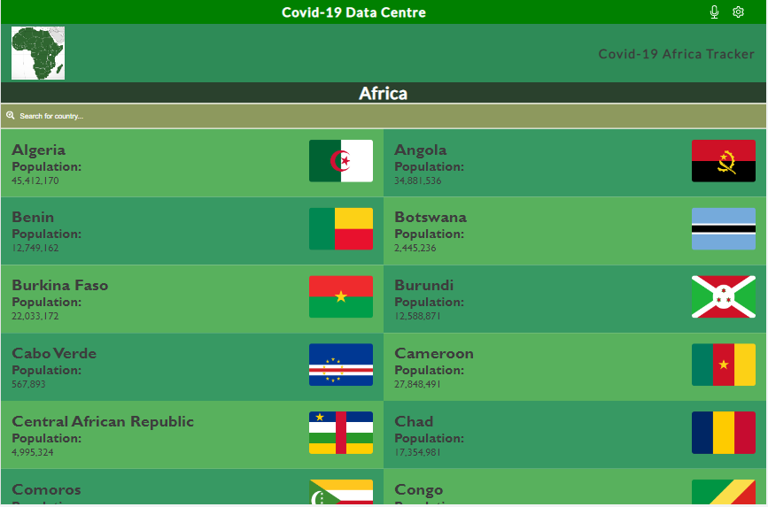
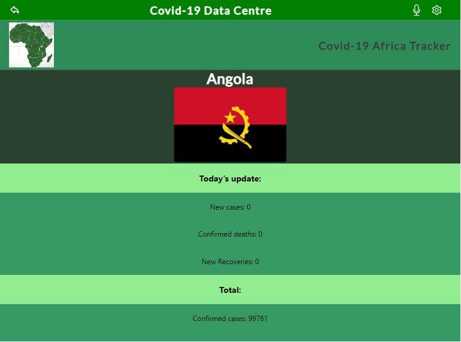

# Metrics Webapp Capstone project

This is a mobile web application that displays details of Covid cases in Africa. This details is gotten/fetched from a Covid-19 API.

# Preview Mobile Version

# Preview Desktop Version

## Built With

- Major languages
  - Javascript
  - Css

- Frameworks
  - React
  - React Redux

- Technologies used
  - github
  - npm

## Live Demo (if available)

[Live Demo Link](https://react-capstone-project-metric.herokuapp.com/)

## Page presentation video

#### To get a local copy up and running follow these simple example steps.

- Click on the `Code` button on the repo
- In your local PC, open your terminal in the folder you would like to clone the project.
- Clone the repo with the command: `git clone (copied link)`; like so: `git clone https://github.com/Adanzeakonobi/React-Redux-Capstone-Project.git`
- On the terminal, navigate into the directory like so: `cd bookstore`
- Checkout to branch name like so: `git checkout [branch name]`
- Run `npm i` or `yarn` to install the dependencies
- Run `npm start` or `yarn start` to start the application

## Author

👤 **Adaobi Vivian Okoye**

- GitHub: [@githubhandle](https://github.com/adanzeakonobi) 
- Twitter: [@twitterhandle](https://twitter.com/Adaebubemmuta)
- LinkedIn: [LinkedIn](https://linkedin.com/in/okoyeaadaobi)

## 🤝 Contributing

Contributions, issues, and feature requests are welcome!

Feel free to check the [issues page](https://github.com/Adanzeakonobi/React-Redux-Capstone-Project.git/issues/new).

## Show your support

Give a ⭐️ if you like this project!

## Acknowledgments

- **Facebook** for making such a wonderful framework
- **Microverse** : for the opportunity to be part of a global network
- **Nelson Sakwa on Behance** : Whose original design idea was used
